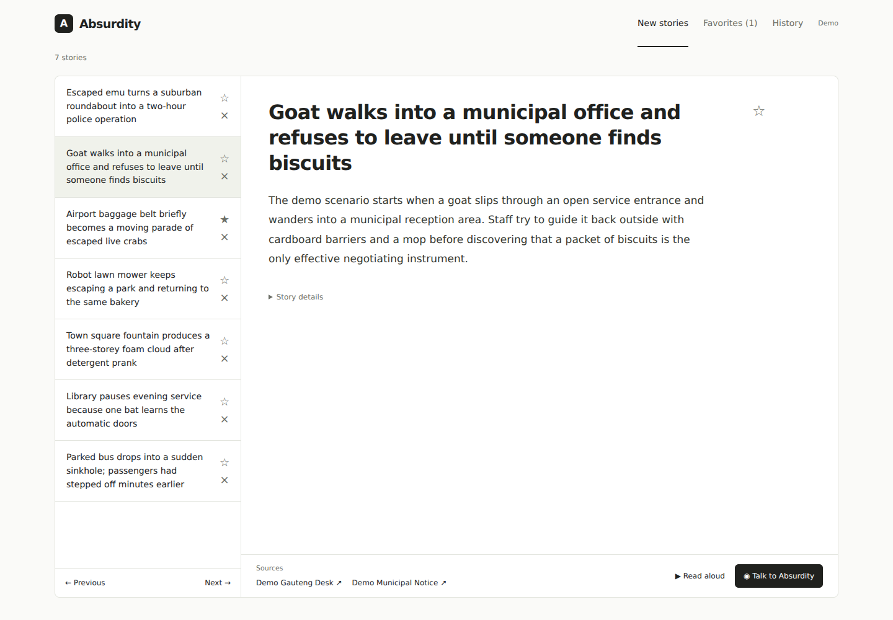
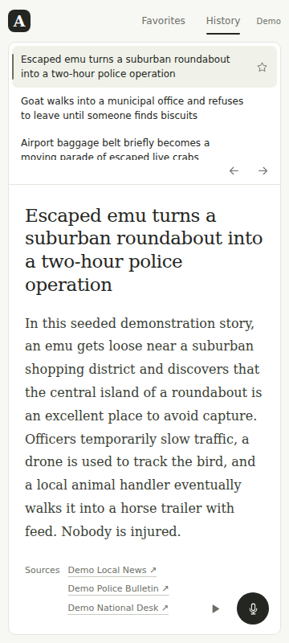
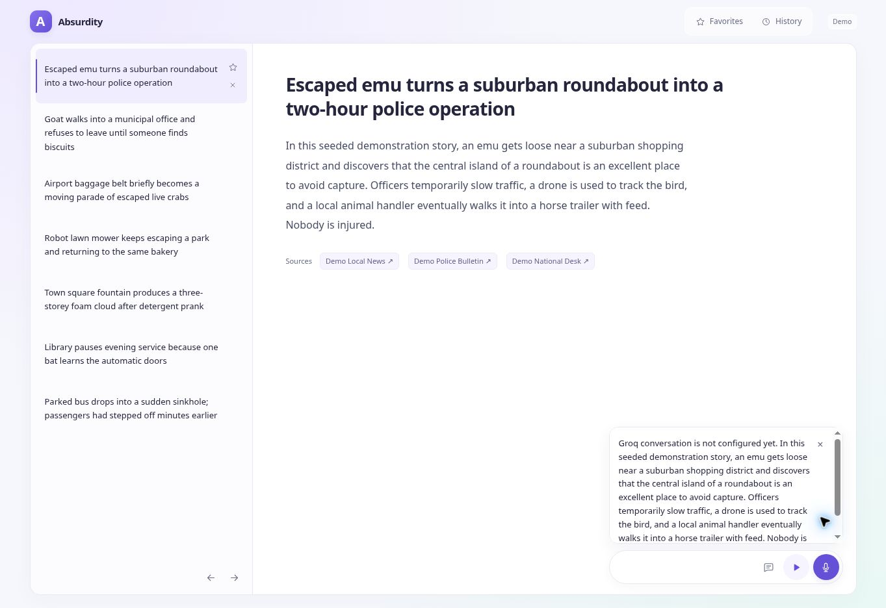
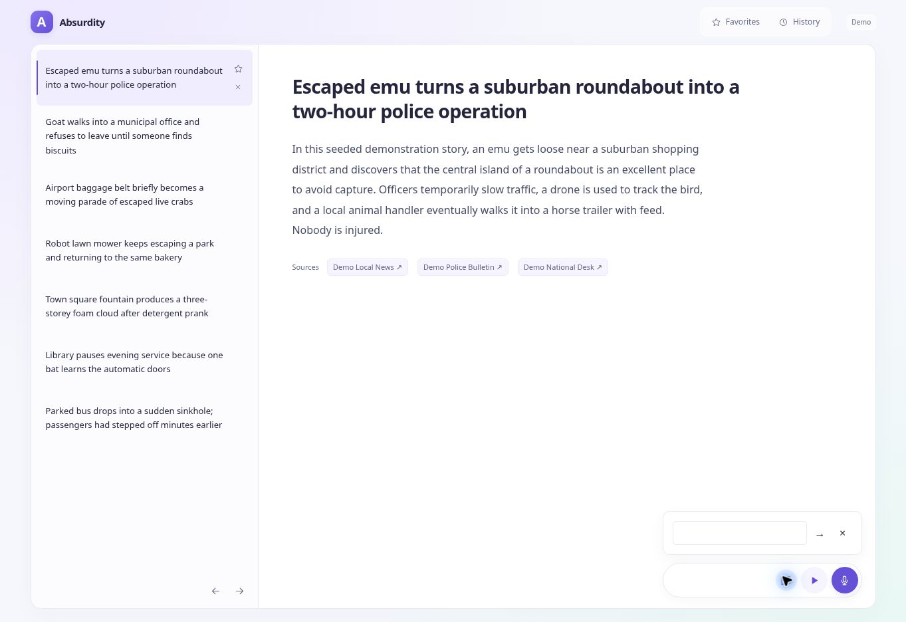
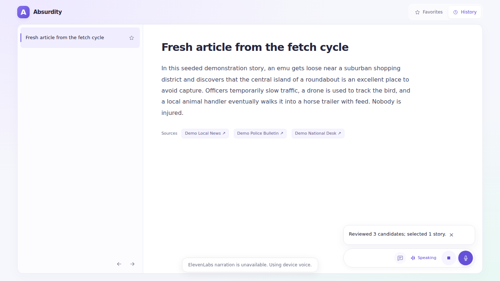
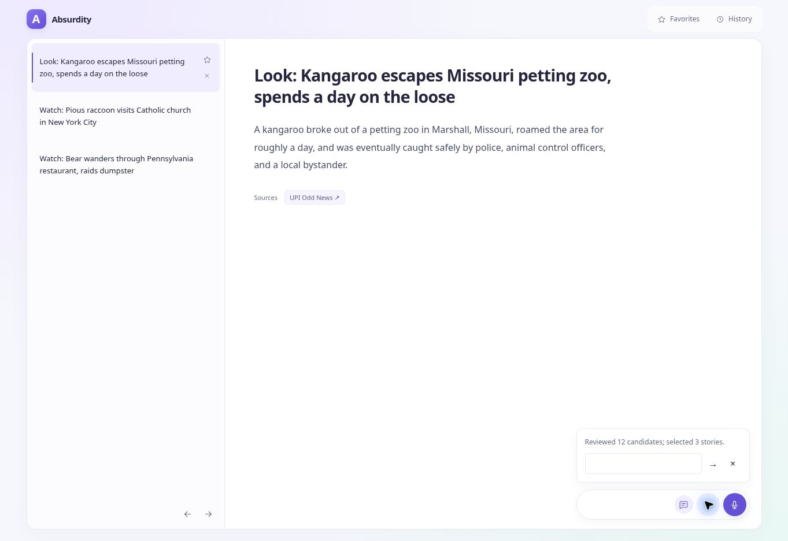

# QA: notebook reader and reliability fixes

## Latest reliability pass — 2026-10-06

- Fixed repeat processing of selected stories: canonical URLs and recent event clusters are checked before paid provider work and the candidate cap. Unselected candidates remain eligible; unrelated later events may reuse a headline.
- Applied the date window before publisher caps and preserved Exa priority in the final shortlist.
- Prevented two publisher labels on the same domain from counting as independent discovery sources in deterministic fallback.
- Allowed database initialization to retry after a failed connection/setup attempt, and aligned default health mode with the live reader.
- Added archive loading/error states, bounded archive requests, explicit retry, cached-story retention on failure, and strict explicit-demo handling for malformed responses.
- Updated browser checks and README for separate Home and Refresh controls and honest empty live archives.
- Added constant-query archive hydration: History now loads story rows, sources and research steps in three database queries instead of two child queries per story; the regression suite asserts the query count stays constant as the archive grows.
- Restored the compact publication-date/verification footer and enabled daily scheduled research by default, with `ENABLE_DAILY_RESEARCH=false` retained as a quota kill switch.
- Verified: **59 automated tests**, TypeScript and the production build before the final UI/documentation sweep. Browser provider/voice responses are stubbed; database regressions use isolated SQLite. Production Turso/provider credentials remain runtime checks.

## Product layout

The October notebook defines a simple interface: New stories, Favorites and History; a scrollable title list beside a scrollable story; source links after the article; and a speak button for navigation. The homepage covers the current 48 hours, with older stories retained in History.

The reader now follows that layout. Per-story category badges, ranked metadata, repeated instructions, large verification cards and the promotional subtitle have been removed from the default view. Only the article title is a visible heading. Source links follow the article inside the scrolling reading pane, followed by one quiet footer containing the publication date and verification confidence; the full verification note stays available as a tooltip rather than another card. Small read/talk controls stay at the bottom-right. Manual search/date fields, story counts and repeated favorite controls have been removed. Requested navigation instructions search stored stories; they never invoke discovery. The chatbox has no visible command list, placeholder or explanatory text; it shows only the input, controls and an actual reply. A compact typed instruction box opens from the chat control or when speech recognition is unavailable or microphone access is denied. On phones the title list sits above the reading pane within the viewport. The visual system is monochrome black/white/grey, with red reserved for the black question-mark brand tile. A small floating dock shows listening, thinking, preparing and speaking states, with reserved space so it cannot cover the article, sources or footer. Styling adds no fonts or dependencies; conversation requests run only after user instructions.

## Verified

- Production build and TypeScript.
- 53 automated regressions: archive/search with combined criteria and date bounds, navigation parsing, Johannesburg publication days, API validation, demo grounding, narration fallback, healthy and degraded database readiness, empty-database initialization, required-Turso startup protection, atomic story/source/research rollback, SQLite story/source/research persistence, 48-hour and future-date filtering, permanent selected history, research-run telemetry, Groq response validation and provider failures, structured conversation plans, article/history context, rejection of invented actions/IDs, exclusion of reasoning text, actual archive result counts and safe live fallback.
- Browser checks at 1366×768, 1280×720, 360×640, 360×800 and 844×390 in Africa/Johannesburg: repeated voice next commands, favorite/favorites distinction, favorite and dismissal reload persistence, requested geography/category/older/favorites search, typed navigation after microphone denial, dismiss/restore, source links, browser speech fallback, cancellation during narration preparation, conversational context, microphone pause/resume, echo suppression and cancellation of pending conversation actions.
- No page errors, page-level scrolling or horizontal overflow in those browser checks.

Speech recognition and synthesis are stubbed for repeatable control tests, so real microphone recognition and audible playback still require device testing. Live Render/Turso connectivity was verified on 2026-10-06 before the persistence hardening. The current deployment now requires Turso explicitly, performs a database readiness check before startup and before scheduled research, creates schema on an empty database, and uses atomic batches for story/source/research updates. Hosted provider credentials and audible ElevenLabs playback are external runtime checks rather than claims made by CI.

## Run checks

```bash
npm ci
npm test
npm run typecheck
npm run build
npm start
```

For the optional browser regression script, install Playwright locally without changing application dependencies:

```bash
npm install --no-save --package-lock=false playwright
npx playwright install chromium
node tests/browser-smoke.mjs
node tests/browser-research.mjs
node tests/browser-reliability.mjs
```

Run against a separate demo database and demo server. The script changes only its fresh browser profile. Set `QA_BASE_URL` for a different server, `QA_CHROMIUM_PATH` for an existing Chromium executable, and optionally `QA_SCREENSHOT_DIR` to capture screenshots.

## Hosting region

`region: frankfurt` selects where the Render backend runs. It does not restrict the public site's visitors to Europe. This configuration runs one regional backend, rather than replicated compute in multiple regions.

## Reader previews







The deployed empty chatbox was verified after the descriptor cleanup; actual replies remain visible.



Full article ingestion checks cover paragraph/tail retention, publisher character encoding, removal of scripts and page chrome, restricted-page fallback, unsafe hosts and redirects, byte/type/deadline limits, native socket address pinning, full-body persistence, preservation after weaker rechecks, bounded model text and the complete discovery → extraction → analysis → storage path. A real ABC source retrieval was attempted here but DNS returned `EAI_AGAIN`; production publisher retrieval is not claimed as verified by this workspace check.

## Refresh fetch cycle

Only the explicit **Refresh** control (or an explicit refresh instruction) starts the discovery/extraction/analysis/persistence pipeline. The black/red question-mark logo and Home are navigation only. Unit checks cover concurrent manual claims, overlap prevention with the daily job, completion and shared cooldown, failed-feed discovery, stale-run recovery, lease ownership, cross-site rejection and joining an active cycle. Browser checks with deterministic API responses verify Home does not spend research quota, repeated Refresh clicks share one run, loading state, refreshed story content, terminal/start failure handling, reload resume without another POST, and the single-page layout.

Scheduled research is now enabled by default at 03:17 UTC (05:17 Johannesburg); `ENABLE_DAILY_RESEARCH=false` is the explicit kill switch. The page itself does not continuously run discovery: it passively checks the saved Turso archive every five minutes while visible and on focus. Explicit web-process fetches can still be interrupted by a deployment/restart, while the GitHub Actions daily job runs the pipeline independently against Turso. Live publisher/provider calls remain separate from mocked browser verification.

## Refresh-command and narration regressions (2026-10-06)

The deployed pre-fix reader displayed one BBC story. Asking "Refresh the stories" claimed that stories had been refreshed, without a research action. Refresh is now a deterministic, explicit action shared with the icon, and never becomes a stored-archive search. The browser regression verifies that the current History article remains visible during a typed fetch and after an empty archive response. Completion reports reviewed candidates and selected stories separately.

Discovery no longer truncates candidates before date filtering and event clustering. UPI Odd News and Guardian World widen the source pool. A complete fixture regression presents 20 stale high-score headlines, one future headline and three recent odd-news stories; all three recent stories are extracted, analysed, stored, selected and returned in the current briefing. RSS publication timestamps are stored as ISO dates. Results still depend on sources and editorial acceptance; a fixed number of live stories is not guaranteed.

ElevenLabs now returns actionable, sanitised errors for a missing voice ID, key/permission failures, quota limits, voice access and invalid audio. Environment values are trimmed. Successful audio, missing voice configuration and provider-error redaction are tested. The browser shows the reason when it falls back to device speech; it does not silently imply ElevenLabs worked. Production credentials and audible playback are not claimed as verified by the mocked regression.



## Live refresh and narration check (2026-10-06)

After deployment of `aeec039`, the typed instruction “Refresh the stories” ran the real research pipeline, reviewed 12 candidates and selected three UPI stories. The reader showed the kangaroo, raccoon and bear articles with publisher links. The live narration request in this historical check reached ElevenLabs and was rejected with HTTP 402. The deployment configuration was subsequently corrected. Device speech remains the fallback, and audible ElevenLabs playback is still treated as a runtime check rather than something CI can prove.

Error handling accepts the current `detail.code` field and legacy `detail.status`, with an actionable HTTP 402 fallback. No raw provider message or credential is exposed.




## Exa-first discovery (2026-10-06)

When `EXA_API_KEY` is configured, Exa is the primary discovery layer. Each cycle runs freshness-bounded news searches across eight editorial lenses, keeps publication dates and source URLs, limits repeated domains before clustering, and then adds RSS candidates as secondary/fallback coverage. Exa discovery results are never promoted directly: article extraction, independent corroboration, Groq verification/classification and the existing promotion rules still apply.

Corroboration searches exclude the discovered article's domain when Exa supports that filter, encouraging independent reporting. Provider telemetry records whether discovery ran as `exa+rss` or RSS-only and how many Exa discovery queries were attempted. Regression coverage verifies the freshness bounds, news category, domain diversity, RSS fallback and Exa request options.
